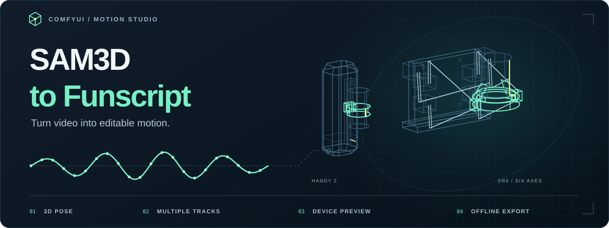

**Turn video into editable motion tracks inside ComfyUI.** Choose an anchor, combine sections, preview the motion and export your funscripts.

[Quick start](#quick-start) · [Workflows](#workflows) · [Full guide](docs/guide.md)

- **Track motion** using body, hand or mouth anchors. Add mask videos to select individual people.
- **Build your timeline** with multiple tracks, zoom, section blending and locks that protect edits across reruns.
- **Edit in a dedicated tab:** use **Motion Studio · Standalone** for a compact workflow node that sends results to the full editor.
- **Preview devices** with Handy 2 for stroke or SR6 for all six axes.
- **Compare device output:** use [stroke profiles](docs/device-output.md) to derive a separate L0 script for a physical range and speed limit.
- **Export and keep editing** with `.funscript` files, your project and a standalone offline editor.

## Install

Use a ComfyUI build with native **SAM3D Body** nodes. Run these commands in the Python environment that runs ComfyUI:

```bash
cd ComfyUI/custom_nodes
git clone https://github.com/ethanfel/ComfyUI-Sam3D-to-Funscript.git
python -m pip install -r ComfyUI-Sam3D-to-Funscript/requirements.txt
```

Download [`sam_3d_body_dinov3_bf16.safetensors`](https://huggingface.co/Comfy-Org/sam-3d-body/tree/main/detection) into `ComfyUI/models/detection/`, then restart ComfyUI.

## Quick start

1. Open the [video-to-funscript workflow](workflows/video_to_funscript.json).
2. Choose a video in **Load Video** and select your SAM3D model.
3. Choose a target anchor in **Poses → Multi-axis Motion**, then run the workflow.
4. Open **Open full motion editor** to review the video, pose and motion curves.
5. Edit the curves, preview a device and choose **Download project + scripts**.

The default workflow streams video in batches and caches the poses. Changing anchors or calibration reuses that cache.

For a smaller graph, replace **Preview & Export Funscripts** with **Motion Studio · Standalone**, connect the same `project_0`, `project_1`, … inputs, and click **Open Motion Studio in new tab**. The tab receives workflow reruns automatically. The node also outputs `project_path` and `viewer_path` for the exported project and offline HTML. See [dedicated-tab editing](docs/guide.md#dedicated-tab-editing).

| Setting | What to know |
|---|---|
| `sample_fps` | Set to **0** to analyse every source frame. |
| `max_frames` | Limits the analysed clip length. Increase it for longer videos. |
| `batch_size` | Start with **8**; larger batches need more memory. [Benchmarks →](docs/performance.md) |
| **Auto fit** | Adapts direction and range over time, independently for each anchor. |

## Edit the motion

- **Combine anchors:** connect more motion projects to the preview node. Each becomes a source track.
- **Use a section:** select a source row, Shift-drag a time range, then click **Use selection in main**. All available axes copy to their matching main axes, preserving locks. Choose **Blend** for smooth joins.
- **Fit motion automatically:** L0 defaults to **Adaptive · per anchor**, so large movements elsewhere in the clip do not set one range for the entire track. Use **Whole clip** for manual range control, or **Fit selection as track** for a separate section.
- **Protect finished work:** click **Lock**. The device preview and exported scripts follow the **main** tracks.

Your download includes `project.json` and `viewer.html`. Open the viewer and choose the matching source video to keep editing offline. The video itself stays separate.

## Workflows

| Start from… | Open this workflow |
|---|---|
| A video | [Streaming extraction](workflows/video_to_funscript.json) |
| Cached poses | [Resume from cache](workflows/cached_pose_to_funscript.json) |
| Several anchors | [Multiple motion tracks](workflows/multitrack_anchors.json) |
| A mask for each person | [Separate people](workflows/mask_videos_to_funscripts.json) |
| Native ComfyUI prediction nodes | [Core-node workflow](workflows/core_video_to_funscript.json) |

## Before you export

This is a development-stage authoring tool. Review tracking around occlusions, camera changes and hand motion. Device previews are schematic and do not control hardware or validate its physical limits.

[Full guide](docs/guide.md) · [Performance](docs/performance.md) · [Device wireframes](assets/device-previews/README.md) · [Research](research/SAM3D_FUNSCRIPT_BLUEPRINT.md)

## License

[GPL-3.0-only](LICENSE). Model weights and third-party dependencies retain their own licenses.
