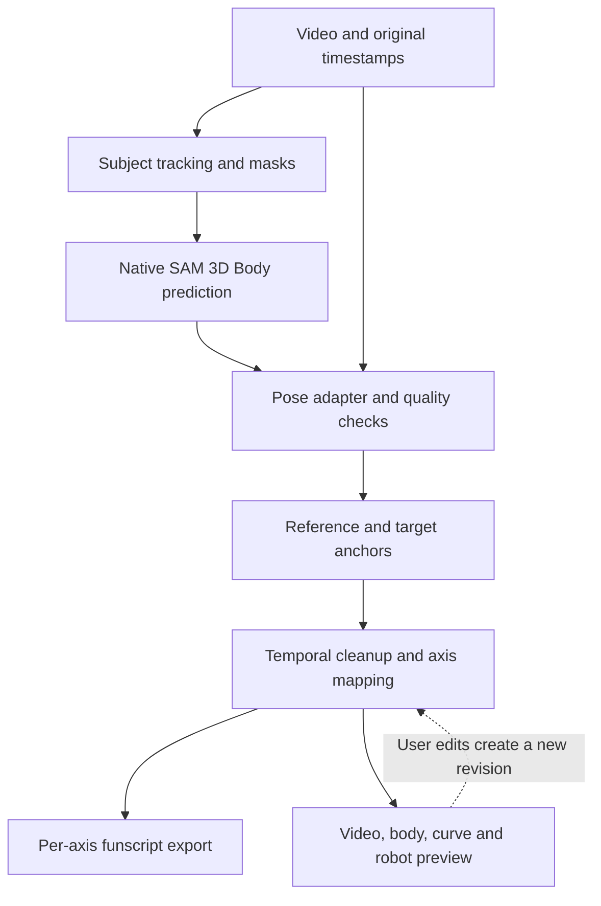

# SAM 3D to multi-axis funscripts in ComfyUI

**Research and implementation blueprint · 7 September 2026**

Prepared for the ComfyUI-Sam3D-to-Funscript project. Scope: local video analysis, editable multi-axis motion, conventional funscript export, synchronized preview, and a later embedded robot simulator. All external sources were accessed on 7 September 2026; undated links refer to the live documentation or source inspected that day.

**Recommendation:** build a motion-authoring extension around ComfyUI’s native SAM 3D Body output. Preserve timestamps and subject identity, derive motion relative to an explicitly selected reference, and let the user review and edit the resulting curves. Export conventional per-axis funscripts. Embed a browser simulator after making its clock follow the video timeline.

This is a feasible engineering project. The unresolved research problem is reliably interpreting the intended movement from ambiguous or occluded footage. A convincing body mesh alone does not solve that problem.

This deliverable includes a successful native inference smoke test in the requested local conda environment. The complete authoring extension, player integrations, and simulator have not been implemented or tested. Recommendations below are proposed engineering decisions unless identified as existing behavior.

## 1. What is available now

| Component | Verified state | Role in this project |
|---|---|---|
| Native ComfyUI SAM 3D Body | Support merged in August 2026, PR #14370. Prediction, temporal smoothing, rendering, and animation export are available. | Preferred inference adapter. Consume the pose payload directly. [ComfyUI integration](https://github.com/Comfy-Org/ComfyUI/pull/14370) |
| Comfy-Org SAM 3D weights | Repackaged DINOv3 BF16 and INT8 variants, loaded from the detection model category. | Use existing BF16 weights as the reference configuration; compare quantization only after a baseline. [Model card](https://huggingface.co/Comfy-Org/sam-3d-body) |
| ComfyUI-SAM3DBody by Andrea Pozzetti | Separate wrapper with experimental environment isolation and depth-assisted features. | Optional compatibility adapter if required by an existing workflow. [Repository](https://github.com/PozzettiAndrea/ComfyUI-SAM3DBody) |
| SAM-Body4D | Video pipeline combining identity masks, SAM 3D, temporal stabilization, and optional diffusion completion. | Source of temporal methods and an optional research comparison. [Repository](https://github.com/gaomingqi/sam-body4d) |
| FunGen 2 | Release 2.6.1, 27 August 2026; native Linux builds. Current implementation is closed source. Version 2.6.0 advertises auxiliary axes for VR. | Relevant external generation/editor benchmark. Its advertised axes do not establish accurate 3D reconstruction. [Release](https://github.com/ack00gar/FunGen/releases/tag/v2.6.1), [changelog](https://fungen.app/changelog/), [publisher](https://fungen.app/) |
| FunscriptForge | 0.4.18-alpha, 5 September 2026. Current generation uses audio beats, with transformation and procedural motion features. | Study editing, diagnosis, and procedural styling. [Release](https://github.com/liquid-releasing/funscriptforge-releases/releases/tag/v0.4.18-alpha), [generation guide](https://liquid-releasing.github.io/funscriptforge/guide/generating-funscripts/) |
| OpenFunscripter | Original repository archived in September 2023; release 3.2.0 dates to December 2022. Linux AppImage exists. | Legacy editor interoperability target. The original project is a poor starting point for a new embedded UI. [Repository](https://github.com/OpenFunscripter/OFS), [release](https://github.com/OpenFunscripter/OFS/releases/tag/v3.2.0) |
| MultiFunPlayer | Release 1.32.1, 19 March 2026. Windows/WPF application with configurable interpolation, mapping, limits, and transports. | Strong playback reference and compatibility target when Windows is available. [Repository](https://github.com/Yoooi0/MultiFunPlayer), [release](https://github.com/Yoooi0/MultiFunPlayer/releases/tag/1.32.1) |
| XTPlayer | Release 0.6.5, 2 August 2026; Linux AppImages; release adds TCode 0.4. | First external playback candidate for the local Linux workflow. [Release](https://github.com/jcfain/XTPlayer/releases/tag/v0.6.5) |
| funlib | TypeScript package 0.4.4; schemas, parsing, conversions, visualization, TCode helpers. | Evaluate for browser import and curve utilities; audit transport helpers before using them. [Repository](https://github.com/Eroscripts/funlib) |
| osr-emu | Browser emulator 0.7.0, last published December 2023; OSR2+, SR6, and SSR1 models. | Best directly reusable browser robot preview found in this research. Its age and media-clock behavior require adaptation. [Repository](https://github.com/ayvasoftware/osr-emu) |

**A correction to the earlier conversation:** the indexed FunscriptForge “Multi-axis tab” page is stale. A September 2026 cleanup removed outdated documentation, while procedural multi-axis generation remains in source. Its current Generate feature is beat-driven. The earlier page remains useful only as a historical example of filename conventions. [Documentation cleanup](https://github.com/liquid-releasing/funscriptforge/commit/1f8c0ebdf22a850aec0d3a4faeaa1cf765c4ea12), [current multi-axis implementation](https://github.com/liquid-releasing/funscriptforge/blob/1f8c0ebdf22a850aec0d3a4faeaa1cf765c4ea12/forge/multiaxis.py)

The bounded search did not establish an existing maintained package that already combines native SAM 3D, reviewed relative motion, multi-axis authoring, and an embedded ComfyUI robot simulator. The components are available; their integration is the work.

## 2. What SAM 3D provides—and what still needs interpretation

SAM 3D Body is a single-image human mesh estimator. Its authors explicitly identify a limitation: people are reconstructed independently, without modeling human–human or human–object interactions. Consequently, relative placement and physical interaction can be wrong even when each individual reconstruction looks plausible. Masks improve subject separation in overlapping scenes. [Meta’s SAM 3D Body paper, February 2026, especially Appendix C](https://arxiv.org/html/2602.15989v1)

The useful output contract includes:

| Output | Meaning |
|---|---|
| `pred_keypoints_3d` | 70 mapped landmarks, each with three coordinates |
| `pred_joint_coords` | 127 skeleton joint positions |
| `pred_global_rots` | 127 joint orientation matrices |
| `pred_vertices` | Body surface vertices; 18,439 in the tested configuration |
| `pred_cam_t` | Translation used to place reconstructed points in camera coordinates |
| `pred_keypoints_2d`, `focal_length`, `bbox` | Image projection and camera/crop information |
| Shape, scale, pose, and MHR parameters | Information needed to retain and regenerate the underlying rig |

The public estimator dictionary does not supply a calibrated per-joint confidence or visibility probability. A detector score, mask score, and inferred 3D certainty are different quantities. [Meta estimator source](https://github.com/facebookresearch/sam-3d-body/blob/main/sam_3d_body/sam_3d_body_estimator.py)

The named landmark set has hips, shoulders, limbs, hands, feet, and face landmarks. It does not define a genital/contact landmark or the intended device axis. The authoring tool therefore needs a **virtual anchor**: a point and orientation the user attaches to a body region and adjusts visually. Actual contact, pressure, and the intended device excursion cannot be recovered from the landmark list alone. [MHR70 landmark definitions](https://github.com/facebookresearch/sam-3d-body/blob/main/sam_3d_body/metadata/mhr70.py)

There should be three explicitly distinguishable sources for any curve:

- **Estimated motion:** derived from observed images, with quality and missing-data information.
- **Authored motion:** manually corrected anchors, keyframes, or axis curves.
- **Procedural motion:** generated patterns or secondary-axis styling.

Keep this provenance in the project. It helps the user understand which parts need review.

## 3. The coordinate contract is the first implementation priority

Several apparently reasonable shortcuts would produce incorrect motion.

**Camera translation is separate.** In the camera head, projection uses:

```text
point_camera = point_exported + pred_cam_t
pixel_xy = focal_length * point_camera.xy / point_camera.z + image_center
```

Exported body points alone omit the camera translation. Conversely, adding that translation twice displaces the body incorrectly. Camera-space meters remain monocular estimates; they are not a physical measurement guarantee. [Meta camera head](https://github.com/facebookresearch/sam-3d-body/blob/main/sam_3d_body/models/heads/camera_head.py)

**Point and rotation bases need explicit reconciliation.** The upstream MHR head converts vertex and joint positions from centimeters to meters, then flips Y and Z for exported points. Joint rotation matrices are returned from the rig without the same point conversion. The exposed global Euler triple also has a specific convention. Treating that triple as device twist/roll/pitch would be incorrect. [Meta MHR head](https://github.com/facebookresearch/sam-3d-body/blob/main/sam_3d_body/models/heads/mhr_head.py)

For a basis conversion `F = diag(1, -1, -1)`, whether an orientation becomes `F R` or `F R F^-1` depends on whether only its destination frame or both its source and destination bases change. Establish that contract with known poses and forward-kinematics checks. Keep matrices or unit quaternions internally.

**A display export may intentionally remove motion.** ComfyUI’s GLB path changes coordinate convention for glTF and offers camera-translation export choices. A centered preview export is unsuitable as the primary measurement source. Use `MHR_POSE_DATA` before display/export transformations. [ComfyUI GLB helpers](https://github.com/Comfy-Org/ComfyUI/blob/master/comfy_extras/sam3d_body/export/glb_shared.py)

**Proposed relative-motion formulation:** define a reference frame A and a target frame B in the same camera coordinate system:

```text
relative_position(t) = transpose(R_A(t)) * (p_B(t) - p_A(t))
relative_rotation(t) = transpose(R_A(t)) * R_B(t)
```

Then apply a user-selected neutral pose, an explicit robot-axis binding, signs, and gains.

This formulation cancels a common rigid camera transform algebraically. It cannot cancel independently incorrect body scales, depths, occlusion guesses, or identity swaps. For one subject, a torso or pelvis frame can serve as the reference; for two subjects, each reconstructed body must first have a consistent placement and scale.

For the first implementation, construct a frame from non-collinear named landmarks such as hips and upper torso. Detect degenerate configurations. Later, use rig orientations after their conventions have been verified. A camera-fixed reference should also be available when whole-body movement is intentionally the signal.

## 4. Recommended end-to-end pipeline



The dotted feedback is an authoring revision, not a cyclic ComfyUI execution graph.

### A. Ingest media with its original timebase

Use a file-backed video source and retain decoded presentation timestamps. For each frame:

```text
project_time_ms = round(1000 * (PTS * time_base - project_start_seconds))
```

Keep the original integer PTS, rational timebase, and trim offset in the project. A frame counter divided by an average frame rate can drift on variable-frame-rate material. Image batches without source timing need an explicitly supplied frame rate. [PyAV timing documentation](https://pyav.org/docs/stable/api/time.html)

Retain a reversible mapping if producing a constant-frame-rate preview proxy. Avoid decoding a long source into one giant image tensor. Use bounded chunks and a seekable preview.

Detect shot boundaries before temporal fitting. PySceneDetect’s adaptive detector is a useful starting point because its rolling comparison can reduce false cuts from fast camera movement. Let users correct the cut list. Reset identity association, filters, and neutral calibration at real cuts. [PySceneDetect detector documentation](https://www.scenedetect.com/docs/latest/api/detectors.html)

Start with ordinary perspective video. VR180, fisheye, and stereo material need explicit view extraction and camera calibration; a whole side-by-side or equirectangular frame is not an ordinary perspective image.

### B. Establish identity and visibility

Carry stable tracker IDs independently of per-frame detection order. Offer subject selection and track reassignment in the preview. Preserve masks and disappearance flags through every processing stage.

The native pose envelope currently contains frames, faces, image size, colors, and a hand mask; it does not carry a complete timeline or stable identity contract. Its tracking helper can return no tracking for a frame-count mismatch, and an empty mask can produce a full-frame bounding box. These behaviors were inspected in source; both fallback cases were reproduced in the local probe. [Native pose node](https://github.com/Comfy-Org/ComfyUI/blob/master/comfy_extras/nodes_sam3d_body.py), [tracking helper](https://github.com/Comfy-Org/ComfyUI/blob/master/comfy_extras/sam3d_body/utils.py)

Proposed adapter behavior: preserve those fallback conditions as explicit diagnostic flags. A successful neural-network call must not automatically become a reliable motion observation.

### C. Run native SAM 3D and cache its output

Begin with the existing BF16 model and a small batch. Enable hand refinement for clips whose chosen anchor depends on hand detail. The local smoke test used body-only inference and batch size two; it does not justify a universal batch recommendation.

Store raw MHR parameters, camera information, selected joints, masks or visibility summaries, and model/source versions. Full mesh sequences should be optional or chunked. Cache expensive inference so changes to gains, smoothing, or keyframes do not rerun the model.

Cache keys should include the source fingerprint, frame selection, model checksum, inference configuration, and subject/mask selection. Edits to the authoring recipe form a separate revision.

### D. Stabilize the observation sequence

Use reliable frames to estimate a consistent body shape and scale per subject and shot. Preserve articulation. For rig-based body preview, regenerate geometry from the stabilized parameters instead of independently averaging every surface vertex.

SAM-Body4D supplies a relevant published method: tracked masklets, masked pose estimation, fixed shape/scale, and temporal smoothing. Its optional diffusion completion reconstructs hidden content, introducing synthesized evidence. [SAM-Body4D](https://github.com/gaomingqi/sam-body4d)

Its authors report, for five people over 90 frames on an H800 80GB, approximately 2m55s and 40.87GB for their 4D stage without completion, versus 26m7s and 53.28GB with completion; tracking is additional. These are their configurations, not estimates for this machine. The cost supports keeping completion outside the initial required path. [Authors’ resource report](https://github.com/gaomingqi/sam-body4d/blob/master/assets/doc/resources.md)

Proposed sequence:

1. Retain raw observations and mark missing or implausible spans.
2. Resolve identity switches before filtering.
3. Estimate stable shape/scale from a set of reliable observations.
4. Repair only short, explicitly marked gaps.
5. Filter positions and orientations within each shot.
6. Derive the relative-motion signal and expose its quality alongside the curves.

Useful quality indicators include mask disappearance, independently observed 2D landmark disagreement, abrupt changes in reconstructed scale, motion discontinuities, and degeneracy of the chosen reference frame. A projection check against the model’s own 2D output tests coordinate consistency; it is not independent evidence of accuracy.

For offline authoring, compare a modest forward-backward filter with the native smoother. Tune for timing and amplitude preservation, with explicit edge treatment for short segments. SciPy’s `sosfiltfilt` provides forward-backward filtering. [SciPy documentation](https://docs.scipy.org/doc/scipy/reference/generated/scipy.signal.sosfiltfilt.html)

For a later live mode, the 1-Euro filter offers a speed-dependent jitter/lag tradeoff. Its parameters depend on signal units and must be tuned on representative motion. [Original authors’ guide](https://gery.casiez.net/1euro/)

Use sign-consistent quaternions and appropriate rotation interpolation; avoid arithmetic smoothing of wrapped Euler angles. SLERP interpolates rotations along the shortest path, which is useful for short gaps but cannot recover an unobserved complete revolution. [SciPy SLERP](https://docs.scipy.org/doc/scipy/reference/generated/scipy.spatial.transform.Slerp.html)

### E. Author the mapping

Let the user choose a target, reference, virtual anchor offset, neutral pose, and active axes per segment. Show the selected frame and motion direction in 3D.

Map a displacement or angle to normalized position with explicit calibration:

```text
u = clamp((signal - calibrated_low) / (calibrated_high - calibrated_low), 0, 1)
position = output_low + u * (output_high - output_low)
```

Handle a constant signal as constant motion, with a defined neutral value. Avoid per-frame or rapidly sliding min/max normalization: it can amplify tiny noise into full-range movement.

Keep physical units, normalized authoring values, and device calibration separate. An estimated ten-centimeter movement does not automatically imply ten centimeters of robot travel.

Use fixed video timing as the default. Speed reduction may require reduced travel or an authored adjustment; moving timestamps to lengthen strokes changes synchronization. Show any adjustment against the raw curve.

### F. Export compatible files

Use conventional filenames first:

| Channel | Motion convention | File |
|---|---|---|
| L0 | Stroke / up-down | `clip.funscript` |
| L1 | Surge / forward-back | `clip.surge.funscript` |
| L2 | Sway / left-right | `clip.sway.funscript` |
| R0 | Twist about L0 | `clip.twist.funscript` |
| R1 | Roll about L1 | `clip.roll.funscript` |
| R2 | Pitch about L2 | `clip.pitch.funscript` |

MultiFunPlayer documents this discovery convention. Available physical axes depend on the configured device. [MultiFunPlayer usage](https://github.com/Yoooi0/MultiFunPlayer#how-to)

The initial export contract should be integer `at >= 0` in milliseconds and integer `pos` from 0 to 100 inclusive. Sort timestamps, remove identical duplicates, and surface conflicting duplicates. Use explicit axis inversion in the generated values instead of relying on poorly supported metadata. [funlib schema](https://github.com/Eroscripts/funlib/blob/d27bb295b9421e8f4aed08f9f5a0f36666af932d/funscript.schema.json)

Preserve endpoints, intentional holds, important reversals, segment transitions, and authored keys during simplification. Bound error against the evaluated curve in position-at-time units. Simplifying six channels independently is acceptable only when evaluating them on a common timeline preserves their combined motion.

funlib supports richer bundled formats, but its support is not proof of universal player compatibility. Keep the rich project as the master and conventional files as the first interchange format.

## 5. Current methods worth comparing

| Method | Strength | Main limitation | Proposed use |
|---|---|---|---|
| Manual keyframes | Direct control and useful reference annotations | Labor and subjective interpretation | Ground-truth authoring baseline |
| 2D tracking / optical flow | Useful visible motion signal with relatively simple processing | Perspective, camera motion, and occlusion; no reliable depth | Lightweight comparison baseline |
| Per-frame SAM 3D plus cleanup | Body geometry and orientations in an existing ComfyUI workflow | Temporal jitter, depth ambiguity, missing interaction modeling | First production candidate |
| Temporally fitted SAM sequence | Stable identity/shape and more coherent motion | Additional optimization and failure handling | Next accuracy improvement |
| Diffusion-assisted completion | Can produce coherent hidden-body reconstructions | Synthesized motion and substantial cost | Optional experiment with provenance |
| Procedural secondary axes | Easy to author from an existing primary curve or rhythm | Does not measure the depicted 3D motion | Explicit creative mode |
| Global-motion estimator | Addresses moving-camera world trajectories | Extra preprocessing, assumptions, and licensing constraints | Research comparison for difficult clips |

Legacy FunGen documentation describes a conventional pipeline of sparse classification, region detection, optical flow, smoothing, and keyframe extraction. Its Python version is now unmaintained and has restrictive usage terms. Study the method rather than adopting it as the new foundation. [Legacy method documentation](https://github.com/ack00gar/FunGen-AI-Powered-Funscript-Generator/blob/main/DOCS-v1.md), [current legacy repository notice](https://github.com/ack00gar/FunGen-AI-Powered-Funscript-Generator)

GVHMR is a useful comparison for global human motion under camera movement. Its frequently cited fast inference figure excludes preprocessing, and its ordinary license grant is restricted to educational, research, or nonprofit use. It should remain an optional research backend until its need and terms are settled. [GVHMR repository](https://github.com/zju3dv/GVHMR), [license](https://github.com/zju3dv/GVHMR/blob/main/LICENSE)

No source reviewed establishes that SAM 3D will outperform a carefully authored 2D method on every clip. Compare results by scene difficulty and correction effort.

## 6. Preview and simulator inside ComfyUI

The proposed preview has four synchronized elements:

- Original video with selectable tracks, projected landmarks, and anchor overlays.
- A 3D body view with reference/target frames and optional motion trails.
- Six axis curves with raw, processed, and authored versions; uncertain spans stay visible.
- A robot view driven by the exact evaluated curves and selected device profile.

Add scrubbing, frame stepping, short loops, playback speed, per-axis mute/invert, neutral calibration, keyframe edits, and undo/redo. A selected curve point should identify the corresponding video time and source observation.

ComfyUI supports JavaScript extensions, DOM widgets, and registered bottom-panel tabs. Use a compact node preview with an expandable authoring panel. Keep frontend changes scoped to this extension. [Extension API](https://docs.comfy.org/custom-nodes/js/javascript_overview), [bottom-panel API](https://docs.comfy.org/custom-nodes/js/javascript_bottom_panel_tabs)

The native Load3D viewer can preview common mesh/animation formats and is useful for validating exports. A synchronized six-axis editor and device simulator need additional UI logic. [Load3D documentation](https://docs.comfy.org/built-in-nodes/Load3D)

### Reusing osr-emu

osr-emu accepts TCode through a browser API and includes OSR2+, SR6, and SSR1 geometry. It is a practical source for the mechanical display. [Project and API](https://github.com/ayvasoftware/osr-emu)

However, its axis implementation uses `performance.now()`; incoming commands trigger real-time ramps, including automatic smoothing for ordinary live commands. Repeatedly sending commands during a scrub would therefore produce a display that depends on elapsed wall time. [Axis implementation](https://github.com/ayvasoftware/osr-emu/blob/e5f58f1649dd92fe5c6da0dec6356f3ec6be49f2/lib/axis.js)

Proposed adaptation: add a direct normalized-pose setter or injectable clock, so `evaluate(project_time)` determines every displayed axis. Keep the graph cursor, body pose, and robot pose on that same timebase. Use video presentation callbacks during playback, plus explicit updates for seeking and paused frame stepping. [Browser video-frame callbacks](https://developer.mozilla.org/en-US/docs/Web/API/HTMLVideoElement/requestVideoFrameCallback)

The emulator’s SR6 implementation contains mechanical calculations and fixed dimensions, with some clamping and warning behavior. It is not a complete device calibration or workspace-validity API. Its dimensions cannot be assumed to match every SR6 build. [SR6 implementation](https://github.com/ayvasoftware/osr-emu/blob/e5f58f1649dd92fe5c6da0dec6356f3ec6be49f2/lib/models/sr6/sr6.js)

Build the simulator in two stages:

1. **Kinematic preview:** reproduce normalized axis motion deterministically and show the robot mechanism.
2. **Device-aware validation:** apply actual geometry, servo conventions, travel limits, and combined-axis reachability; display requested versus achievable motion.

Force, physical contact, and soft-body simulation require additional models and measurements. A graphical preview does not validate those properties.

Bundle browser dependencies locally. osr-emu references an older Three.js generation, so isolate its dependency or deliberately port it. Dispose of renderers, listeners, and animation loops when a preview closes.

## 7. Suggested ComfyUI extension and project structure

Keep a small Python motion core that can be tested independently, a native-pose adapter, and a browser editor. The core should operate without requiring an interactive browser.

ComfyUI’s V3 API supports custom data types and node outputs. Use the API version supported by the target installation and document it. Custom routes can serve project manifests and chunked preview data; existing execution messages can announce new revisions. [V3 API](https://docs.comfy.org/custom-nodes/v3_migration), [server routes](https://docs.comfy.org/development/comfyui-server/comms_routes), [server messages](https://docs.comfy.org/development/comfyui-server/comms_messages)

Proposed nodes, **not currently implemented names**:

| Node | Inputs | Output / responsibility |
|---|---|---|
| Import Pose Sequence | Native MHR pose, timing, track mapping | Canonical pose sequence and diagnostics |
| Define Motion Anchors | Pose sequence and segment recipe | Relative translations/orientations |
| Build Axis Curves | Relative motion, filters, calibration, edits | Multi-axis authoring data |
| Preview Motion | Project and preview media | Synchronized review panel |
| Export Funscripts | Axis data and export settings | Conventional per-axis files |
| Save/Load Motion Project | Project path or current revision | Resume authoring without rerunning inference |

Reuse existing media/model/track nodes. Add a dedicated file-backed ingestion node only where retaining PTS and chunking requires it. Separate a user-selected device profile from the pose model.

Suggested file ownership:

```text
core/         coordinate conversion, relative motion, filters, curves, export
adapters/     native MHR pose and media timebase
nodes/        thin ComfyUI interfaces
web/          video, timeline, body viewer, emulator adapter
profiles/     explicitly versioned device geometry and mappings
tests/        coordinate, timing, interpolation and export fixtures
examples/     small complete ComfyUI workflows
```

The canonical project should record:

| Record | Minimum contents |
|---|---|
| Media | Source fingerprint, PTS/timebase, trim, projection type, proxy mapping |
| Tracking | Stable IDs, slot mapping, masks/visibility, shot boundaries |
| Pose | Units, coordinate conventions, camera intrinsics/translation, joints, orientations, original MHR parameters |
| Quality | Observed/missing/inferred state and named diagnostic metrics |
| Recipe | Target/reference, anchors, neutral pose, filters, gains, inversions |
| Curves | Active channels, interpolation, raw/processed/authored provenance |
| Device profile | Normalized-to-physical mapping, geometry and firmware conventions |
| Reproducibility | Model checksum, ComfyUI/extension versions, configuration and edit revision |

Use JSON for manifests and compact numeric arrays for frame data. Keep large arrays outside workflow JSON. Key saved state to project and workflow identity so two open workflows do not accidentally share the selected project.

## 8. Interpolation, device limits, and transport

Funscript and TCode are separate layers. A funscript stores a trajectory; a player or bridge turns it into commands.

The public TCode 0.3 specification defines user-relative directions: L0 up, L1 away, L2 left; the rotations follow the right-hand rule around those axes. Magnitudes are less than one, and interval extensions use milliseconds. Convert the 0–100 script range to the chosen protocol precision deliberately; do not send a literal magnitude of one using the decimal-mantissa convention. [TCode 0.3 specification](https://github.com/multiaxis/TCode-Specification)

TCode 0.4 exists and XTPlayer 0.6.5 supports it. The creator describes firmware-side curve interpolation, but this research did not establish a complete authoritative public syntax specification for the new commands. Start with a tested common command subset and version the transport adapter separately. [XTPlayer release](https://github.com/jcfain/XTPlayer/releases/tag/v0.6.5), [Tempest MAx’s May 2026 update](https://www.patreon.com/tempestvr/posts/may-26-update-157793091)

Player settings can change the trajectory between exported points. MultiFunPlayer offers interpolation choices including PCHIP and Makima. Match the preview’s interpolation to the intended playback configuration, and evaluate speed and combined-axis motion after interpolation. [MultiFunPlayer](https://github.com/Yoooi0/MultiFunPlayer)

An implementation audit also found an apparent units mismatch in funlib’s TCode scaling helper: a position expressed on a 0–100 scale is used directly in `min + pos * (max - min)`. This is a static-inspection concern, not a reproduced library defect. Treat the library’s parser/schema and device-output helper as separate adoption decisions. [Inspected helper](https://github.com/Eroscripts/funlib/blob/d27bb295b9421e8f4aed08f9f5a0f36666af932d/src/utils/tcode.ts)

For eventual physical playback, make calibration, supported axes, combined reachability, startup/seek behavior, and stop behavior explicit. Independent slider limits alone cannot describe a coupled mechanism’s reachable workspace. The first implementation milestone should remain file export and software review.

## 9. Local tests performed

The user authorized testing with `/media/p5/Comfyui` and conda environment `13_env_py313`.

The local environment is distinct from the machine reached by the ComfyUI MCP connector. **These inference measurements are from the local RTX 5090.**

| Item | Observed locally |
|---|---|
| ComfyUI source | Commit `15eb748b3ec5f8a0a2d470b7fb280e2d7579f916`; version file 0.34.0 |
| Python | 3.13.11, conda environment `13_env_py313` |
| PyTorch | 2.11.0+cu130 |
| Frontend package | 1.51.9 |
| GPU | NVIDIA GeForce RTX 5090; approximately 32GB VRAM |
| Weights | Existing `sam_3d_body_dinov3_bf16.safetensors` in the configured P5 model cache |
| Test image | Upstream SAM 3D `notebook/images/dancing.jpg`, 1920×1280 |
| Configuration | Full-frame single person, body-only, default FoV, batch size two |

Results:

| Check | Result |
|---|---|
| Native imports and model discovery | Succeeded |
| Model construction/loading | 54.85 seconds in this run |
| Cold single-image prediction | 1.73 seconds |
| Warm two-identical-frame prediction | 0.294 seconds total |
| Peak PyTorch allocated memory | 3.09GB; excludes driver and other-process overhead |
| Geometry | 70 landmarks, 127 joint positions, 127 rotation matrices, 18,439 vertices |
| Numeric output | All inspected numeric arrays finite |
| Camera projection round trip | RMSE approximately 0.000025 pixels |
| Rotation orthogonality | Maximum absolute deviation approximately 0.00000036 |
| Repeated-image landmark difference | Maximum absolute difference approximately 0.00000012 meters |
| Empty 32×24 mask | Returned full-frame bbox `[0, 0, 32, 24]` |
| Tracking/frame-count mismatch | Returned no tracking inputs |

Evidence: [raw diagnostic results](test-results/native-sam3d-2026-09-07/results.json), [reproducible probe](probes/native_sam3d_smoke.py).

Interpretation: the native model runs in the requested environment, its numerical outputs have the expected structure, and the camera-translation formula is consistent. The measurements cover a repeated still image, without SAM tracking, hand refinement, video decoding, or real motion. They do not establish sustained FPS, contact accuracy, temporal robustness, or multi-axis usefulness.

No conda packages, model files, or ComfyUI source files were changed for this test. The model directory was registered only inside the probe process. Earlier empty model-list results came from the separate MCP-connected runtime.

## 10. Validation needed before calling the pipeline complete

Use a small manually reviewed clip set covering a clear single subject, two subjects, partial occlusion, disappearance/re-entry, camera translation, camera rotation/zoom, a shot cut, and variable-frame-rate media. Add VR only when its projection handling exists.

Proposed acceptance gates:

| Area | Required evidence |
|---|---|
| Coordinates | Known translations and rotations map to the correct signed axes; camera translation applied once; consistent units and handedness |
| Identity | No unmarked subject swaps; disappearance and re-entry preserve explicit visibility and association state |
| Timing | Original timestamps survive decode, trim, export and reload; no cumulative drift |
| Filtering | Report reversal-time shift, amplitude change, and jitter reduction against reviewed reference curves |
| Missing data | Gap policy is visible; long unsupported spans do not silently become inferred full-range motion |
| Export | All files satisfy the schema; integer, ordered times; round-trip curves remain within a chosen error budget |
| Preview | Seeking to a timestamp twice yields the same curves/body/robot pose; pause and frame stepping are deterministic |
| Device model | Axis signs, neutral position and combined reachability match the chosen geometry and firmware |
| Performance | Measure end-to-end clip runtime, peak RAM/VRAM, cache reuse, cancellation and resume |
| Human correction | Measure time spent repairing scripts, with failures categorized by scene type |

Useful initial numerical targets for engineering fixtures—not validated model-accuracy claims—are: export approximation error at most one position unit, UI time alignment within one source-frame duration, and zero unmarked identity swaps. Tighten or relax these against representative material and actual device behavior.

Compare native raw motion, native smoothing, the proposed relative-motion method, a simple 2D baseline, and manually authored reference curves. Use separate development and holdout clips when tuning filters. Record phase/amplitude errors and correction effort instead of relying only on visual mesh quality.

## 11. Implementation order

| Stage | Concrete deliverable | Exit condition |
|---|---|---|
| 1. Native pose adapter | Import raw pose plus PTS, units, IDs and visibility; save a reusable project | Coordinate/timing fixtures pass on the existing environment |
| 2. First complete stroke workflow | Select anchors, derive L0, edit curve, export and reload | Reviewed short clip produces a usable primary script |
| 3. Multi-axis authoring | Add orientation-derived rotations and additional translations where supported by the selected mapping | Every channel has documented source, sign, neutral and gain |
| 4. Embedded review UI | Synchronized video, body and curves; save edits; undo/redo | Seek, pause, reload and multiple-workflow behavior pass |
| 5. Robot emulator | Deterministic osr-emu adapter, device selection, requested/achievable pose display | Known-axis fixtures and repeated seeking agree |
| 6. Robust video processing | Per-shot tracking, quality flags, shape stabilization, chunking and resume | Difficult clip set and long-run resource tests pass |
| 7. Optional playback bridge | Versioned TCode transport with device-specific calibration and controls | Tested against the actual selected hardware/firmware |

Keep all six channel slots in the project schema from the beginning. Export only active, intentionally authored channels. Stage 2 provides an early complete workflow; later stages improve capability and reliability without changing the file contract.

**The next concrete build task is Stage 1:** a native `MHR_POSE_DATA` adapter with explicit timing, identity, visibility, and coordinate conventions, followed immediately by a reviewed primary-axis conversion.

## 12. Dependency and evidence boundaries

SAM model code/weights use Meta’s custom SAM license. MHR is Apache 2.0; osr-emu is MIT; OFS and XTPlayer are GPL-3.0; MultiFunPlayer is MIT. FunGen 2 is closed source, and legacy FunGen has restrictive terms. funlib’s package declares MIT, but a standalone license file was not found in the inspected tree. Keep component notices and distribution decisions separate. [SAM license](https://github.com/facebookresearch/sam-3d-body/blob/main/LICENSE), [MHR](https://github.com/facebookresearch/MHR), [osr-emu license](https://github.com/ayvasoftware/osr-emu/blob/main/LICENSE), [funlib package metadata](https://github.com/Eroscripts/funlib/blob/main/package.json)

Primary evidence covered current source, release metadata, original model papers, official documentation, and the local smoke test. Stale pages were reconciled against source or changelogs. Publisher feature claims were not treated as independently measured accuracy.

Remaining gaps are target-video accuracy, full public TCode 0.4 curve syntax, runtime interoperability with external players, simulator integration, and actual device calibration. The research is sufficient to start implementation with those limits explicit.

Document verification: Markdown rendering, table structure, local file links, probe syntax, and the recorded numerical checks passed. Visual page review was not performed.
